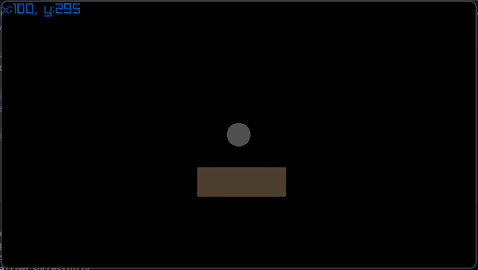

A minimalistic Zig experiment using game mechanics and Raylib.
---



SETUP & QUICK START
-------------------

Requirements:
* Zig (latest) - https://ziglang.org/download/
* Raylib auto-fetched via build.zig.zon

Run:
```
git clone https://github.com/AkitooSama/space-game.git
cd space-game
zig build run
```
---

PROJECT STRUCTURE
-----------------
```
src/
|-- main.zig        : Core logic entry
|-- player.zig      : Player logic
|-- json.zig        : Config loader
|-- settings.json   : Game parameters
```
* Note: Scratch files `root.zig` and `test.zig` excluded - experimental use only.
---

LICENSE
-------
MIT Licensed. Clone, modify, learn - no strings.
Full terms in [MIT License](./LICENSE).